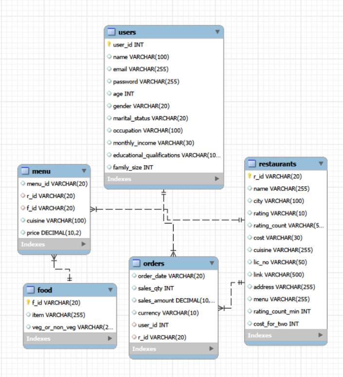
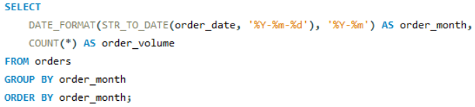
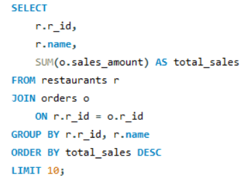
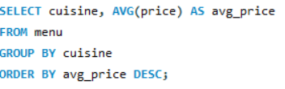
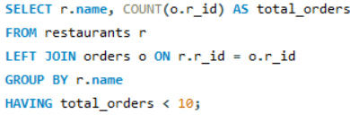
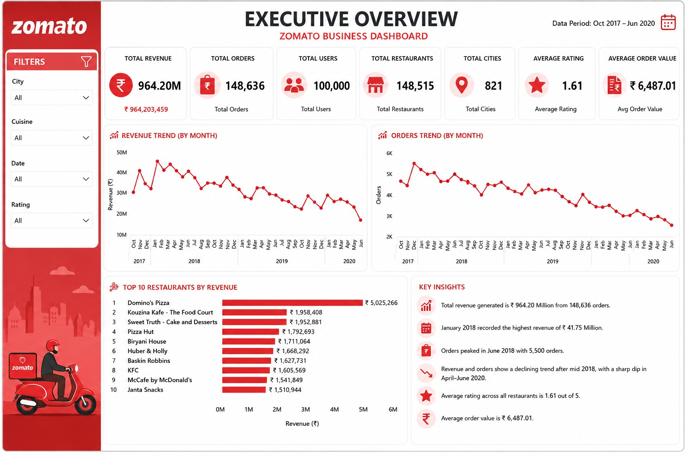
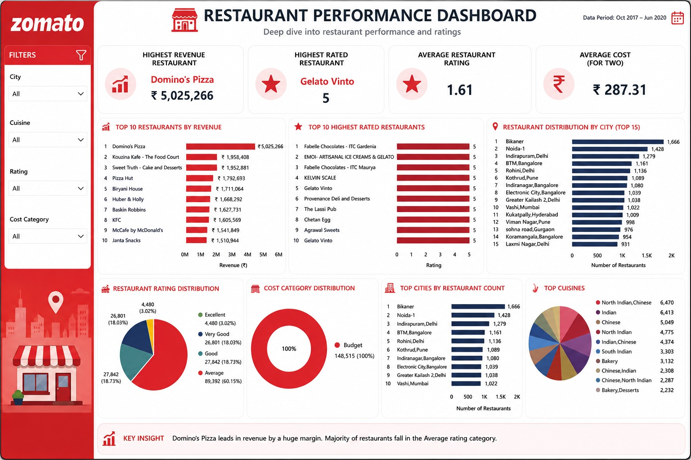

# 🍽️ Zomato Restaurant Data Analysis (SQL + Power BI)

Analysis of a Zomato-style restaurant database using **MySQL** to answer real business questions about sales, restaurants, cuisines and customers, with the results visualised in a **Power BI** dashboard.


---

## 📌 Project Overview

**Objective:** Use SQL to extract business insights from restaurant, menu, user and order data to support data-driven decisions across the food delivery ecosystem.

**Workflow:**

```
Dataset → MySQL database → SQL queries → Power BI dashboard → Insights → Recommendations
```

**Skills demonstrated:** relational schema design, primary/foreign keys, data cleaning, multi-table `JOIN`s, aggregations (`SUM`, `AVG`, `COUNT`), `GROUP BY` / `HAVING`, subqueries, `CASE` expressions, date functions, and `LEFT JOIN` logic.

---

## 🗄️ Database Schema

Five related tables in a MySQL database named `sql_project`:

| Table | Rows | Description | Key |
|---|---|---|---|
| `users` | 100,000 | Customer demographics (age, gender, occupation, income…) | `user_id` |
| `restaurants` | ~148,500 | Name, city, cuisine, rating, cost for two | `r_id` |
| `orders` | ~150,000 | Order date, quantity, sales amount, user and restaurant | `user_id`, `r_id` (FKs) |
| `menu` | ~1.18 million | Dishes offered by each restaurant, with price | `r_id`, `f_id` (FKs) |
| `food` | ~371,500 | Food items and veg / non-veg type | `f_id` |

*Row counts are taken from the project presentation, before orphan-row cleanup.*



---

## 📁 Repository Structure

```
zomato-sql-analysis/
├── README.md
├── LICENSE
├── .gitignore
├── sql/
│   ├── 01_create_schema.sql          # database + tables + keys
│   ├── 02_load_data.sql              # load CSV files
│   ├── 03_data_cleaning.sql          # remove orphan rows
│   ├── 04_business_questions.sql     # 14 questions + 4 extra insights
│   └── 05_kpi_dashboard_queries.sql  # queries behind the dashboard
└── docs/
    └── images/                       # ER diagram, dashboards, query outputs
```

---

## ▶️ How to Run

**Requirements:** MySQL 8.x and MySQL Workbench (or any MySQL client).

1. **Clone the repo**
   ```bash
   git clone https://github.com/<your-username>/zomato-sql-analysis.git
   ```
2. **Get the dataset.** The CSV files are not included in this repository because of their size (the menu table alone has over 1 million rows). Place them in a local folder.
3. **Run the scripts in order** from the `sql/` folder:
   1. `01_create_schema.sql`
   2. `02_load_data.sql` — edit the file paths at the top first
   3. `03_data_cleaning.sql`
   4. `04_business_questions.sql` and `05_kpi_dashboard_queries.sql`

> If `LOAD DATA LOCAL INFILE` is blocked, enable it with `SET GLOBAL local_infile = 1;` and turn on `OPT_LOCAL_INFILE=1` in your client connection settings.

---

## 🔍 Business Questions Answered

| # | Question | Techniques |
|---|---|---|
| 1 | Top 10 restaurants by total sales | `JOIN`, `SUM`, `GROUP BY`, `LIMIT` |
| 2 | Average rating and rating count in the top 20 cities | Subquery, `AVG` |
| 3 | Monthly order trend | `DATE_FORMAT`, `STR_TO_DATE` |
| 4 | Top 5 cuisines by order volume | `JOIN`, `COUNT` |
| 5 | Veg vs non-veg menu items | `JOIN`, `GROUP BY` |
| 6 | Top 20 cities by restaurant count | `GROUP BY` |
| 7 | User demographics vs average order value | `CASE`, multi-column grouping |
| 8 | Top 15 highest-spending users | `JOIN`, `SUM` |
| 9 | Cuisines with the highest average menu price | `AVG` |
| 10 | Restaurants with the most diverse menu | `COUNT(DISTINCT)` |
| 11 | Most widely listed food items | `JOIN`, `COUNT` |
| 12 | Spending behaviour by gender | Aggregation |
| 13 | Peak order days of the week | `DAYNAME` |
| 14 | Order frequency by income group | Aggregation |

**Additional insights:** underperforming restaurants (`LEFT JOIN` + `HAVING`), menu pricing by cuisine, cuisine demand by city, price vs popularity.

### Sample query outputs

| Top 10 restaurants by sales | Monthly orders |
|---|---|
|  |  |

| Menu pricing by cuisine | Underperforming restaurants |
|---|---|
|  |  |

---

## 📊 Power BI Dashboards

**Executive Overview**


**Restaurant Performance**


---

## 💡 Key Findings

*(Data period: Oct 2017 – Jun 2020, from the dashboard)*

- Total revenue of about **₹964 million** from roughly **148,600 orders** placed by **100,000 users** across **148,515 restaurants** in **821 cities**.
- **Domino's Pizza** is the top restaurant by revenue (about ₹5.0 million), well ahead of every other restaurant.
- Revenue and order volume were highest in early-to-mid 2018 and **declined steadily afterwards**, with a sharp drop in April–June 2020.
- Pizza, bakery and quick-service brands feature prominently among the top revenue earners.

## ✅ Recommendations

- Support low-rated restaurants through training and quality checks.
- Expand popular cuisines in high-demand areas.
- Increase marketing in top-performing cities.
- Use dashboards for continuous monitoring of sales and ratings.

---

## ⚠️ Challenges & Solutions

| Challenge | Solution |
|---|---|
| Dates and numbers stored as text | Converted with `STR_TO_DATE()` / `CAST()` before aggregating |
| Non-numeric or missing ratings skewing averages | Filtered with `REGEXP` so only numeric ratings are averaged |
| Orphan records breaking foreign keys | Removed in `03_data_cleaning.sql` |
| Complex multi-table joins | Careful aliasing and `LEFT JOIN` to keep all restaurants |

---

## 🛠️ Tools Used

MySQL 8 · MySQL Workbench · Power BI

## 📄 License

Released under the [MIT License](LICENSE).
